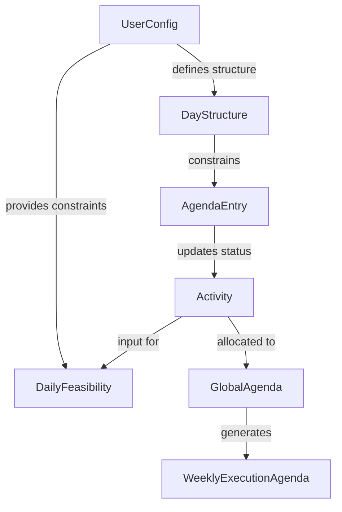

# Data Model: Planning & Scheduling Features

**Date**: 2024-07-17 | **Feature**: 001-planning-scheduling

## Core Entities

### Extended UserConfig (from TimeWise_DataModel.md)

```typescript
type Weekday = "monday" | "tuesday" | "wednesday" | "thursday" | "friday" | "saturday" | "sunday";

type UserConfig = {
  soundEnabled: boolean;
  defaultSessionMaxMinutes: number;
  defaultDailyMaxMinutes: number;
  dailyWorkTargets: Record<Weekday, number>; // hours per day
  weekStart: Weekday;
  
  // NEW: Day Structure Configuration
  dayStartTimes: Record<Weekday, string>; // "HH:MM" format
  lunchBreakStartTimes: Record<Weekday, string>; // "HH:MM" format  
  lunchBreakDurations: Record<Weekday, number>; // minutes
};
```

**Constraints:**
- `dayStartTimes`: Must be valid "HH:MM" format, e.g., "09:00"
- `lunchBreakStartTimes`: Must be valid "HH:MM" format and ≥ dayStartTime for same day
- `lunchBreakDurations`: Must be non-negative integer (minutes)
- Non-working days: Use "00:00" for times and 0 for durations

**Example:**
```json
{
  "dayStartTimes": {
    "monday": "09:00",
    "tuesday": "09:00",
    "wednesday": "09:00",
    "thursday": "09:00",
    "friday": "09:00",
    "saturday": "10:00",
    "sunday": "00:00"
  },
  "lunchBreakStartTimes": {
    "monday": "12:00",
    "tuesday": "12:00",
    "wednesday": "12:00",
    "thursday": "12:00",
    "friday": "12:00",
    "saturday": "12:30",
    "sunday": "00:00"
  },
  "lunchBreakDurations": {
    "monday": 30,
    "tuesday": 30,
    "wednesday": 30,
    "thursday": 30,
    "friday": 30,
    "saturday": 30,
    "sunday": 0
  }
}
```

### Daily Feasibility (New Entity)

```typescript
type DailyFeasibility = {
  date: string; // "YYYY-MM-DD"
  totalDurationMinutes: number;
  dailyWorkTargetMinutes: number;
  feasibilityStatus: "feasible" | "tight" | "not-feasible";
  colorIndicator: "green" | "yellow" | "red";
  activitiesCount: number;
  cognitiveLoadDistribution: {
    intense: number; // minutes
    moderate: number; // minutes  
    light: number; // minutes
  };
};
```

**Constraints:**
- `feasibilityStatus`: Derived from `totalDurationMinutes` vs `dailyWorkTargetMinutes`
- `colorIndicator`: Green (<80% target), Yellow (80-100% target), Red (>100% target)
- Calculated daily based on current activities and user preferences

### Global Agenda (New Entity)

```typescript
type GlobalAgenda = {
  generatedAt: string; // ISO timestamp
  timeRange: {
    startDate: string; // "YYYY-MM-DD"
    endDate: string; // "YYYY-MM-DD"
  };
  dailyDistributions: Record<string, DailyDistribution>; // key: "YYYY-MM-DD"
  totalWorkHours: number;
  averageDailyLoad: number;
};

type DailyDistribution = {
  date: string; // "YYYY-MM-DD"
  allocatedActivities: ActivityAllocation[];
  remainingCapacityMinutes: number;
  isWorkingDay: boolean;
};

type ActivityAllocation = {
  activityId: string;
  allocatedMinutes: number;
  cognitiveLoad: "light" | "moderate" | "intense";
  deadline: string; // "YYYY-MM-DD"
  priority: "low" | "medium" | "high";
};
```

**Constraints:**
- Generated when activities, deadlines, or preferences change
- Distributes work proportionally across remaining days
- Respects daily work targets and day structure constraints
- Excludes non-working days from distribution

### Weekly Execution Agenda (Enhanced)

```typescript
type WeeklyExecutionAgenda = {
  weekId: string; // "YYYY-Www"
  weekStartDate: string; // "YYYY-MM-DD"
  days: Record<string, AgendaEntry[]>; // key: "YYYY-MM-DD"
  dayStructureConstraints: Record<string, DayStructure>; // key: "YYYY-MM-DD"
};

type DayStructure = {
  date: string; // "YYYY-MM-DD"
  dayStartTime: string; // "HH:MM"
  lunchBreakStart: string; // "HH:MM"
  lunchBreakEnd: string; // "HH:MM" (calculated)
  workWindowEnd: string; // "HH:MM" (calculated)
  totalAvailableMinutes: number; // (calculated)
  isWorkingDay: boolean;
};

type AgendaEntry = {
  id: string; // UUID
  activityId: string;
  plannedStart: string; // "HH:MM"
  plannedEnd: string; // "HH:MM"
  durationMinutes: number;
  status: "planned" | "executed" | "executedEarlier" | "skipped" | "postponed" | "adjusted";
  cognitiveLoad: "light" | "moderate" | "intense";
  isDuringLunchBreak: boolean; // NEW: Constraint violation flag
};
```

**Constraints:**
- Agenda entries must fit within day structure work windows
- No overlaps between agenda entries
- Respects lunch break constraints
- Status transitions follow defined workflow

## Data Flow & Relationships



## Storage Schema

### localStorage Keys (Extended)

```text
userConfig (ENHANCED)
├── soundEnabled: boolean
├── defaultSessionMaxMinutes: number
├── defaultDailyMaxMinutes: number
├── dailyWorkTargets: Record<Weekday, number>
├── weekStart: Weekday
├── dayStartTimes: Record<Weekday, string>       ← NEW
├── lunchBreakStartTimes: Record<Weekday, string> ← NEW
└── lunchBreakDurations: Record<Weekday, number> ← NEW

weeklyAgenda (ENHANCED)
├── weekId: string
├── weekStartDate: string
├── days: Record<string, AgendaEntry[]>
└── dayStructureConstraints: Record<string, DayStructure> ← NEW
```

## Validation Rules

### Day Structure Validation

1. **Time Format Validation**: `HH:MM` regex: `/^([01]\d|2[0-3]):([0-5]\d)$/`
2. **Logical Constraints**: `lunchBreakStartTime ≥ dayStartTime`
3. **Boundary Checks**: `0 ≤ lunchBreakDuration ≤ 180` (minutes)
4. **Work Window Calculation**: `workWindowEnd = dayStartTime + (dailyWorkTarget * 60) + lunchBreakDuration`

### Agenda Generation Validation

1. **Time Slot Constraints**: Agenda entries must be within `[dayStartTime, workWindowEnd]`
2. **Lunch Break Avoidance**: No agenda entries during `[lunchBreakStart, lunchBreakEnd]`
3. **Overlap Prevention**: No overlapping agenda entries
4. **Duration Limits**: `sessionMax ≤ duration ≤ dailyMax` per activity

## Migration Strategy

### From Existing Data Model

1. **Backward Compatibility**: Load existing `userConfig` without new fields
2. **Default Values**: Apply sensible defaults for missing day structure fields:
   - `dayStartTimes`: "09:00" for weekdays, "00:00" for weekends
   - `lunchBreakStartTimes`: "12:00" for weekdays, "00:00" for weekends  
   - `lunchBreakDurations`: 30 minutes for weekdays, 0 for weekends
3. **Data Validation**: Validate and correct any invalid data on load
4. **Graceful Degradation**: Continue with partial functionality if migration fails

### Data Model Versioning

```json
{
  "version": "2.1",
  "migrationNotes": "Added day structure configuration fields",
  "backwardCompatible": true
}
```

## Implementation Notes

### Performance Considerations

- **Caching**: Cache day structure calculations to avoid redundant computations
- **Incremental Updates**: Only recompute affected days when settings change
- **Efficient Algorithms**: Use time-slot allocation with O(n log n) complexity
- **Memory Management**: Clean up old agenda data when week changes

### Error Handling

- **Validation Errors**: Clear messages like "Invalid time format. Use HH:MM"
- **Constraint Violations**: "Lunch break cannot start before day start"
- **Data Corruption**: Fallback to defaults with user notification
- **Performance Warnings**: Alert if agenda generation exceeds 1 second

## Testing Data Model

### Test Cases for Day Structure

```javascript
// Valid day structure
const validConfig = {
  dayStartTimes: {"monday": "09:00"},
  lunchBreakStartTimes: {"monday": "12:00"},
  lunchBreakDurations: {"monday": 30}
};

// Invalid: lunch before day start
const invalidConfig1 = {
  dayStartTimes: {"monday": "10:00"},
  lunchBreakStartTimes: {"monday": "09:00"}, // ❌ Error
  lunchBreakDurations: {"monday": 30}
};

// Invalid: bad time format
const invalidConfig2 = {
  dayStartTimes: {"monday": "25:00"}, // ❌ Error
  lunchBreakStartTimes: {"monday": "12:00"},
  lunchBreakDurations: {"monday": 30}
};
```

### Test Cases for Agenda Generation

```javascript
// Normal case: fits within constraints
const normalCase = {
  dayStart: "09:00",
  lunchBreak: {start: "12:00", duration: 30},
  dailyTarget: 7 hours,
  activities: [
    {duration: 120, cognitiveLoad: "intense"},
    {duration: 180, cognitiveLoad: "moderate"}
  ]
  // ✅ Should generate valid agenda
};

// Edge case: tight schedule
const tightCase = {
  dayStart: "09:00",
  lunchBreak: {start: "12:00", duration: 30},
  dailyTarget: 7 hours,
  activities: [
    {duration: 420, cognitiveLoad: "intense"} // Exactly 7 hours
  ]
  // ✅ Should show yellow feasibility indicator
};

// Error case: exceeds capacity
const overflowCase = {
  dayStart: "09:00",
  lunchBreak: {start: "12:00", duration: 30},
  dailyTarget: 7 hours,
  activities: [
    {duration: 500, cognitiveLoad: "intense"} // > 7 hours
  ]
  // ❌ Should show red feasibility indicator
};
```

## Data Model Completion

✅ All entities defined with proper types and constraints
✅ Relationships and data flow documented
✅ Storage schema extended appropriately
✅ Validation rules comprehensive
✅ Migration strategy defined
✅ Performance considerations addressed

**Status**: Ready for implementation