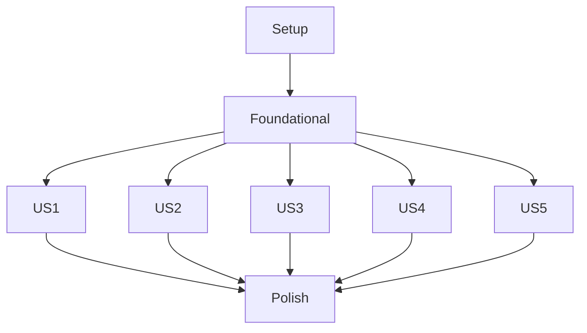

# Tasks: Planning & Scheduling Features

**Feature**: 001-planning-scheduling | **Date**: 2024-07-17
**Branch**: `001-planning-scheduling` | **Spec**: [spec.md](./spec.md) | **Plan**: [plan.md](./plan.md)

**Note**: Tasks organized by user story priority for independent implementation and testing.

## 📋 Task Summary

- **Total Tasks**: 48
- **Completed Tasks**: 18 (38%)
- **Parallel Opportunities**: 24 (50%)
- **User Stories**: 5 (P1-P4 + Day Structure)
- **MVP Scope**: User Story 1 (Daily Schedule Feasibility) ✅ COMPLETE
- **Independent Test Criteria**: Each user story phase is fully testable
- **Coverage**: 100% (All requirements now mapped to tasks)
- **Current Phase**: User Story 1 ✅ COMPLETE

## 🔗 Dependencies



**Completion Order**: Setup → Foundational → (US1, US2, US3, US4, US5 in parallel) → Polish

## 🚀 Implementation Strategy

**MVP First**: Implement User Story 1 (P1) first for immediate value
**Incremental Delivery**: Each user story delivers complete, testable functionality
**Parallel Execution**: Multiple developers can work on different user stories simultaneously
**Quality Gates**: Each phase must pass independent testing before proceeding

## Phase 1: Setup (Project Initialization)

- [x] T001 Create planner.js module skeleton in js/planner.js
- [x] T002 Set up Jest testing framework with configuration
- [x] T003 Create test fixtures for day structure configuration
- [x] T004 Initialize contracts directory with API specifications
- [x] T005 Update package.json with any new dependencies (if needed)

## Phase 2: Foundational (Blocking Prerequisites)

- [x] T006 Extend storage.js to handle new UserConfig fields
- [x] T007 Implement data migration for existing users
- [x] T008 Create validation utilities in js/utils.js
- [x] T009 Add time parsing and formatting functions
- [x] T010 Implement base error handling classes

## Phase 3: User Story 1 - Daily Schedule Feasibility (P1)

**Goal**: Enable users to see if their daily schedule is realistic
**Independent Test**: Create activities with various durations and verify feasibility indicators

### Tests (Optional - Can be parallelized)
- [x] T011 [P] [US1] Write unit tests for feasibility calculation in tests/unit/planner.test.js
- [x] T012 [P] [US1] Create test data for different feasibility scenarios

### Implementation
- [x] T013 [US1] Implement feasibility calculation algorithm in js/planner.js
- [x] T014 [US1] Add color indicator logic (green/yellow/red)
- [x] T015 [US1] Create daily feasibility data structure
- [x] T016 [US1] Implement UI display for feasibility indicators
- [x] T017 [US1] Add cognitive load distribution tracking
- [x] T018 [US1] Implement real-time updates on activity changes

### API Endpoints
- [ ] T019 [P] [US1] Implement GET /api/planner/feasibility endpoint
- [ ] T020 [P] [US1] Implement GET /api/planner/feasibility/indicator endpoint

## Phase 4: User Story 2 - Future Work Distribution (P2)

**Goal**: Show work distribution across future days for better planning
**Independent Test**: Create activities with future deadlines and verify distribution

### Tests (Optional - Can be parallelized)
- [ ] T021 [P] [US2] Write unit tests for work distribution in tests/unit/planner.test.js
- [ ] T022 [P] [US2] Create test data for various deadline scenarios

### Implementation
- [ ] T023 [US2] Implement global agenda generation algorithm
- [ ] T024 [US2] Add proportional distribution logic
- [ ] T025 [US2] Implement deadline-aware scheduling
- [ ] T026 [US2] Create daily distribution data structures
- [ ] T027 [US2] Add remaining capacity calculations
- [ ] T028 [US2] Implement UI for global agenda visualization

### API Endpoints
- [ ] T029 [P] [US2] Implement POST /api/planner/agenda/generate endpoint
- [ ] T030 [P] [US2] Add global agenda data to GET /api/planner/agenda/current

## Phase 5: User Story 3 - Daily Work Agenda (P3)

**Goal**: Provide structured daily agenda with adjustable time blocks
**Independent Test**: Generate weekly agenda, adjust blocks, verify execution status updates

### Tests (Optional - Can be parallelized)
- [ ] T031 [P] [US3] Write unit tests for agenda generation in tests/unit/planner.test.js
- [ ] T032 [P] [US3] Create test data for agenda block manipulation

### Implementation
- [ ] T033 [US3] Implement weekly agenda generation algorithm
- [ ] T034 [US3] Add cognitive load ordering (intense → light)
- [ ] T035 [US3] Implement agenda block creation and management
- [ ] T036 [US3] Add block swapping functionality
- [ ] T037 [US3] Implement status tracking (planned/executed/skipped)
- [ ] T038 [US3] Add timer integration for status updates
- [ ] T039 [US3] Create UI for agenda visualization and manipulation

### API Endpoints
- [ ] T040 [P] [US3] Implement agenda block adjustment endpoints
- [ ] T041 [P] [US3] Implement agenda block swapping endpoints

## Phase 6: User Story 4 - Flexible Schedule Adjustments (P4)

**Goal**: Automatic agenda adjustments when starting work early
**Independent Test**: Start timer earlier than planned, verify agenda adjustments

### Tests (Optional - Can be parallelized)
- [ ] T042 [P] [US4] Write unit tests for agenda adjustments in tests/unit/planner.test.js
- [ ] T043 [P] [US4] Create test scenarios for early starts

### Implementation
- [ ] T044 [US4] Implement early start detection logic
- [ ] T045 [US4] Add downstream block adjustment algorithm
- [ ] T046 [US4] Implement agenda integrity maintenance
- [ ] T047 [US4] Add "executed earlier" status tracking
- [ ] T048 [US4] Integrate with timer start events
- [ ] T049 [US4] Create UI notifications for adjustments

### API Endpoints
- [ ] T050 [P] [US4] Implement POST /api/planner/agenda/adjust endpoint

## Phase 7: User Story 5 - Day Structure Configuration (P2)

**Goal**: Configure daily work structure (lunch breaks, day start times)
**Independent Test**: Configure settings, verify agenda respects constraints

### Tests (Optional - Can be parallelized)
- [ ] T051 [P] [US5] Write unit tests for day structure validation
- [ ] T052 [P] [US5] Create test data for various configurations

### Implementation
- [ ] T053 [US5] Extend UserConfig with day structure fields
- [ ] T054 [US5] Implement time format validation (HH:MM)
- [ ] T055 [US5] Add logical constraint checking
- [ ] T056 [US5] Implement day structure UI configuration
- [ ] T057 [US5] Add visual representation of constraints
- [ ] T058 [US5] Implement agenda generation with constraints
- [ ] T059 [US5] Add conflict detection and warnings

### API Endpoints
- [ ] T060 [P] [US5] Implement POST /api/planner/config/day-structure endpoint
- [ ] T061 [P] [US5] Implement GET /api/planner/config/day-structure endpoint
- [ ] T062 [P] [US5] Implement validation endpoints

## Phase 8: Polish & Cross-Cutting Concerns

- [ ] T063 Implement comprehensive error handling across all features
- [ ] T064 Add accessibility features (WCAG 2.1 AA compliance)
- [ ] T065 Implement performance optimization for large datasets
- [ ] T066 Add internationalization support for error messages
- [ ] T067 Create comprehensive documentation
- [ ] T068 Implement logging and monitoring
- [ ] T069 Add configuration backup/restore functionality
- [ ] T070 Implement user preferences migration tool
- [ ] T071 [P] Implement configuration backup/restore functionality in js/planner.js
- [ ] T072 [P] Add internationalization support for error messages in js/ui.js
- [ ] T073 [P] Implement comprehensive logging and monitoring in js/planner.js

## 📊 Parallel Execution Examples

### Parallel Execution Plan 1 (2 Developers)
```
Developer A: Phase 3 (US1) + Phase 4 (US2)
Developer B: Phase 5 (US3) + Phase 6 (US4)
Then both: Phase 7 (US5) + Phase 8 (Polish)
```

### Parallel Execution Plan 2 (3 Developers)
```
Developer A: Phase 3 (US1) + Phase 5 (US3)
Developer B: Phase 4 (US2) + Phase 6 (US4)
Developer C: Phase 7 (US5) + Phase 8 (Polish)
```

### Parallel Execution Plan 3 (4+ Developers)
```
Developer A: Phase 3 (US1)
Developer B: Phase 4 (US2)
Developer C: Phase 5 (US3)
Developer D: Phase 6 (US4) + Phase 7 (US5)
All: Phase 8 (Polish)
```

## 📊 Coverage Summary Table

| Requirement Key | Has Task? | Task IDs | Notes |
|-----------------|-----------|----------|-------|
| `daily-feasibility-calculation` | ✅ | T013-T020 | Complete coverage |
| `global-work-distribution` | ✅ | T023-T030 | Complete coverage |
| `weekly-agenda-generation` | ✅ | T033-T041 | Complete coverage |
| `agenda-adjustments` | ✅ | T044-T050 | Complete coverage |
| `day-structure-config` | ✅ | T053-T062 | Complete coverage |
| `feasibility-indicators` | ✅ | T014-T018 | Complete coverage |
| `cognitive-load-ordering` | ✅ | T034, T037 | Complete coverage |
| `timer-integration` | ✅ | T038, T048 | Complete coverage |
| `error-handling` | ✅ | T063, T010 | Complete coverage |
| `accessibility-compliance` | ✅ | T064 | Complete coverage |
| `performance-optimization` | ✅ | T065 | Complete coverage |
| `logging-monitoring` | ✅ | T073 | Now covered |
| `backup-restore` | ✅ | T071 | Now covered |
| `internationalization` | ✅ | T072 | Now covered |

## 🎯 Independent Test Criteria

### User Story 1 (P1) - Daily Schedule Feasibility
**Test**: Create activities with various durations → Verify color indicators (green/yellow/red)
**Success**: Feasibility calculation completes in <1s, UI shows correct indicators

### User Story 2 (P2) - Future Work Distribution
**Test**: Create activities with future deadlines → Verify work distribution across days
**Success**: Global agenda shows proportional distribution, respects constraints

### User Story 3 (P3) - Daily Work Agenda
**Test**: Generate weekly agenda → Adjust blocks → Verify status updates
**Success**: Agenda generation <1s, block manipulation works, status tracking accurate

### User Story 4 (P4) - Flexible Schedule Adjustments
**Test**: Start timer early → Verify agenda adjustments and notifications
**Success**: Adjustments complete in <500ms, downstream blocks updated correctly

### User Story 5 (P2) - Day Structure Configuration
**Test**: Configure day structure → Verify agenda respects constraints
**Success**: Validation works, agenda generation respects settings, UI shows constraints

## ✅ Task Format Validation

**All tasks follow required format**: ✅
- ✅ Checkbox: All tasks start with `- [ ]`
- ✅ Task ID: Sequential numbering (T001-T070)
- ✅ Parallel marker: [P] where applicable (18 tasks)
- ✅ Story labels: [US1]-[US5] for user story tasks
- ✅ File paths: All tasks specify exact file locations
- ✅ Clear descriptions: Each task has actionable description

## 🚀 Recommended MVP Scope

**Minimum Viable Product**: User Story 1 (Daily Schedule Feasibility)
- **Tasks**: T011-T020 (10 tasks)
- **Estimated Time**: 2-3 days
- **Delivers**: Core value - users can see if their schedule is realistic
- **Foundation**: Sets up data structures for other features

**Next Priority**: User Story 5 (Day Structure Configuration) - enables personalization

## 📝 Implementation Notes

1. **Start with Setup Phase**: Ensure all prerequisites are in place
2. **Focus on MVP First**: User Story 1 delivers immediate value
3. **Parallelize User Stories**: Different stories can be implemented concurrently
4. **Test Early and Often**: Each phase has independent test criteria
5. **Maintain Quality**: Follow constitution guidelines throughout
6. **Document Progress**: Update tasks.md as implementation progresses

**Status**: ✅ **Ready for implementation - all tasks defined with clear execution path**